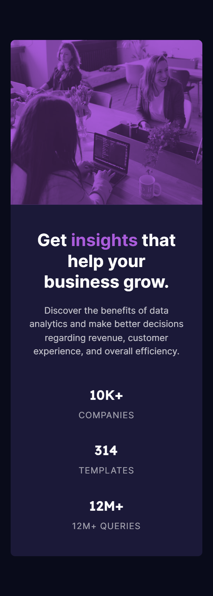

# Frontend Mentor - Stats preview card component solution

This is a solution to the [Stats preview card component challenge on Frontend Mentor](https://www.frontendmentor.io/challenges/stats-preview-card-component-8JqbgoU62). Frontend Mentor challenges help you improve your coding skills by building realistic projects.

## Table of contents

- [Overview](#overview)
  - [The challenge](#the-challenge)
  - [Screenshot](#screenshot)
  - [Links](#links)
- [My process](#my-process)
  - [Built with](#built-with)
  - [What I learned](#what-i-learned)
  - [Continued development](#continued-development)
  - [Useful resources](#useful-resources)
  - [Problems](#problems)
- [Author](#author)
- [Closing](#closing)

## Overview

### The challenge

Users should be able to:

- View the optimal layout depending on their device's screen size

### Screenshot


Mobile View


Desktop View

### Links

- Solution URL: [Add solution URL here](https://your-solution-url.com)
- Live Site URL: [Add live site URL here](https://your-live-site-url.com)

## My process

### Built with

- Semantic HTML5 markup
- CSS custom properties
- CSS Flexbox
- Mobile-first design workflow

### What I learned

```css
.i-learned-to-center-a-div {
  position: fixed;
  top: 50%;
  left: 50%;
  transform: translate(-50%, -50%);
}

.and-i-learned-some-of-this-too {
  width: clamp(80vw, 26.75em, 90%);
  padding-block: 4em;
  height: calc(15em + 1.5em);
}
```

### Continued development

I'll try to optimize the size depends on the device size || nothing

### Useful resources

- [Resoureces](https://https://www.youtube.com/shorts/njdJeu95p6s) - This help me to understand how to center a div using css quickly. Go watch it!.

### Problems

I can't keep the footer to bottom
I'm having troubles with this mobile first design approach.

## Author

- Frontend Mentor - [@executeNgasal](https://frontendmentor.io/profile/executeNgasal)

## Closing

Please let me know if you have better ways to finish this challenge 😉
